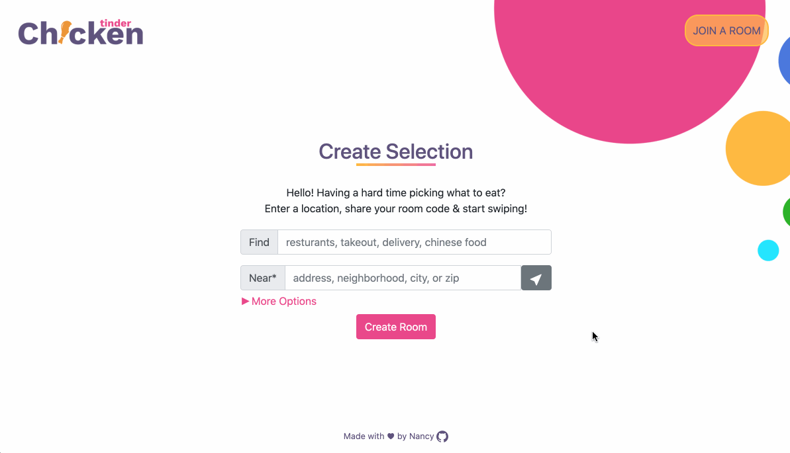
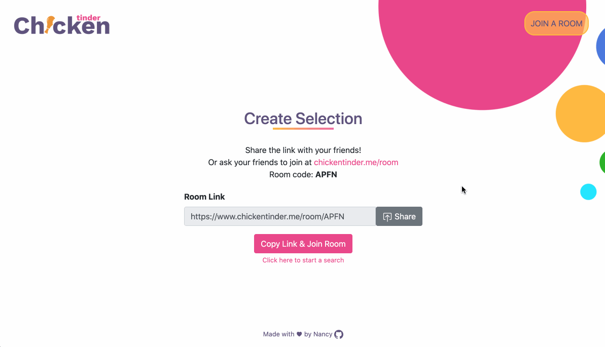
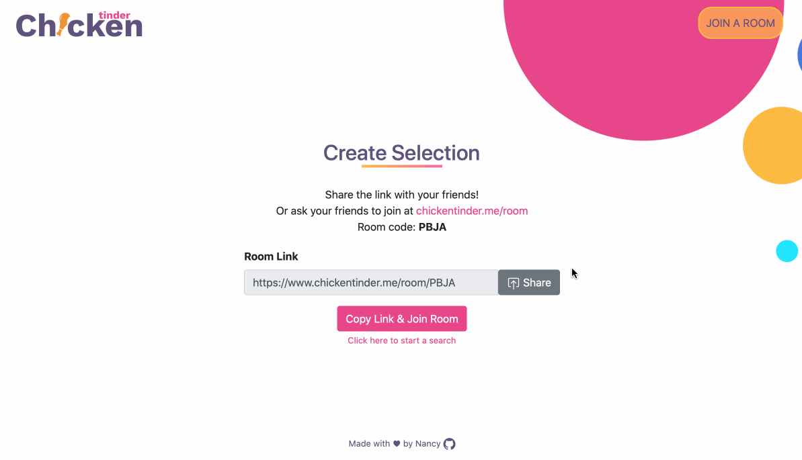
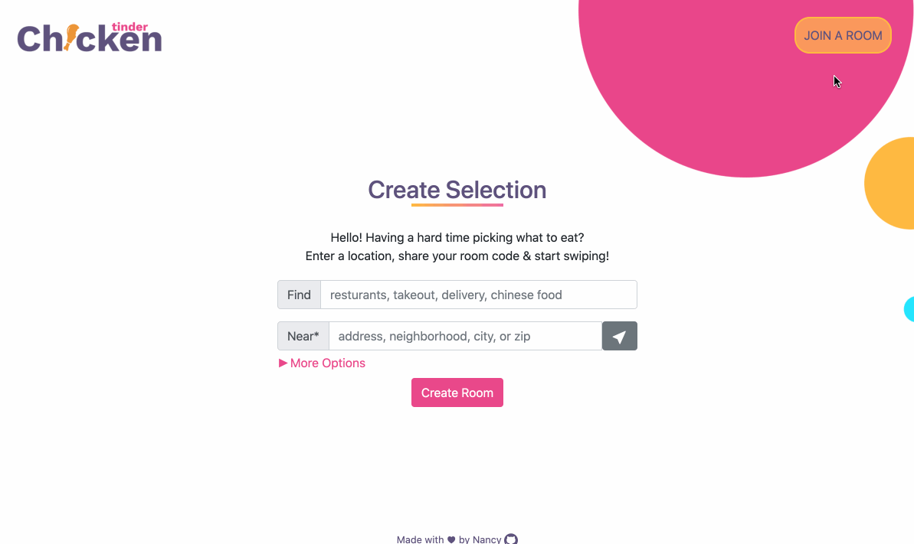
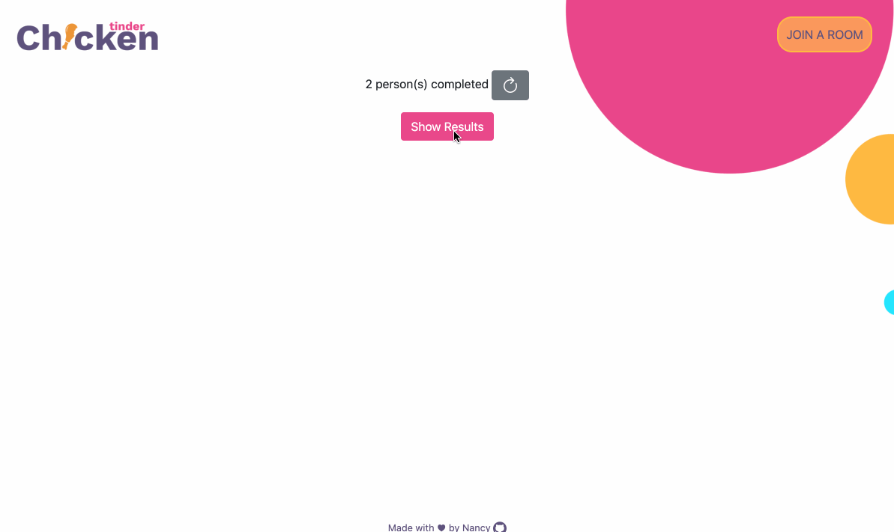

# 🍗 Chicken Tinder

Chicken Tinder is a web app that helps friends and family agree on places to eat, built with Yelp Business Search and Google Geolocation API using React, Python, JavaScript and PostgresSQL.

[https://www.chickentinder.me/](https://www.chickentinder.me/)
Youtube Demo: https://youtu.be/vD0Um8kUNpk

# 💡Features

- Create a search that gathers yelp resturants - Form fields: Find, Near, Num of Cards(to swipe), Open Now, Price Range, Search by
  
- Current location button (works only on secure https)
  
- Generate link to share with other users - room code included in link
- Ability to share link or copy to clipboard
  
  (for mobile - a share navigator will open)
  
- Input Name (12 char) and Room code (4 char) to join - handles invalid room code (expires in 90 mins) - avoid same name entering room twice - ability to jump to results with 4 letter room code
  
- Swiping cards / Like & Dislike button - build with CSS / React using guiding code from - https://codepen.io/dylangggg/full/aeoEpQ - https://codepen.io/RobVermeer/full/japZpY - https://codepen.io/loringdodge/full/BNmRrK
  
- Show winning results - hanle no matches
  

## Database

- Create all 4-letter codes when it first run (seed.py)
- Tables: - Search (created when a search is done) - Business (info returned from Yelp) - User (created when joining a room) - Like (swiping results) - ShortCode (linking search to short code)

# 🖥️ Tech

Chicken Tinder uses a number of different tech:

For Backend:

- Python
- Flask
- PostgresSQL

For Frontend:

- React
- CSS
- HTML
- Bootstrap

# 🚀 Launch

Run seed.py > server.py to boot

Secret file needs

- Yelp Key
- Google API Key (Google Geolocation)
- Database URL
